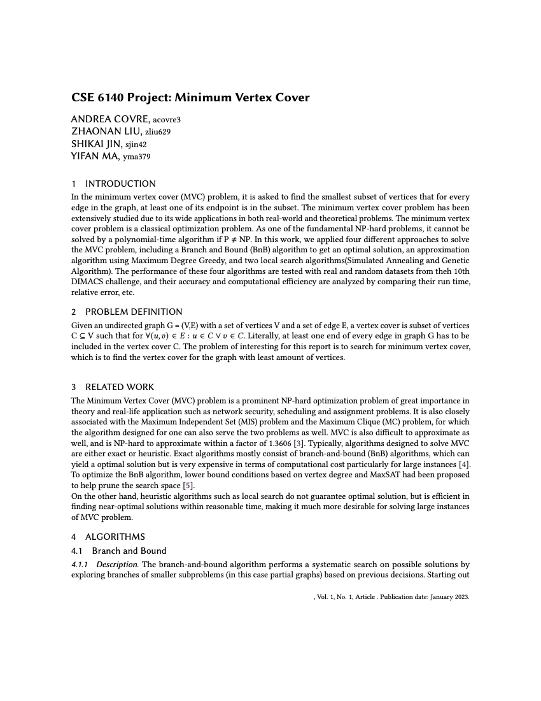

# Algorithms to solve the Minimum Vertex Cover, a NP-Complete problem

## Goal 
With this project we researched, implemented and analyzed different algorithms to effectively and efficiently solve the Minimum Vertex Cover problem. We developed different algorithms and versions of them as to figure out which approaches are the most effective as well as the least costly in terms of computational power and time.

## Datasets

| Problem name | Description | \|V\| | \|E\| | OPT |
|-|-|-|-|-|
| jazz.graph | Jazz musicians network. List of edges of the network of Jazz musicians. | 198 | 2742 | 158 |
| karate.graph | Zachary’s karate club: social network of friendships between 34 members of a karate club at a US univer- sity in the 1970s. | 34 | 78 | 14 |
| football.graph | American College football: network of American foot- ball games between Division IA colleges during regu- lar season | 115 | 613 | 94 |
| as-22july06.graph | Graph of the whole Internet: a symmetrized snapshot of the structure of the Internet at the level of autonomous systems, reconstructed from BGP tables | 22963 | 48436 | 3303 |
| hep-th.graph | Weighted network of coauthorships between scientists | 8361 | 15751 | 3926 |
| star.graph | Star-like structures of different graphs with different types | 11023 | 62184 | 6902 |
| star2.graph | Star-like structures of different graphs with different types | 14109 | 98224 | 4542 |
| netscience.graph | Coauthorship network of scientists working on net- work theory | 1589 | 2742 | 899 |
| email.graph | List of edges of the network of e-mail interchanges between members of a university | 1133 | 5451 | 594 |
| delaunay n10.graph | Delaunay triangulations of random points in the unit square | 1024 | 3056 | 703 |
| power.graph | Network representing the topology of the Western States Power Grid | 4941 | 6594 | 2203 |

## Algorithms implemented and analyzed
- Branch and Bound
- Approximation
- Simulated Annealing 
- Genetic Algorithm

## Report

## Code
### Instructions
#### Running exec.py
To execute the code as set by the project requirements: 
 
`$ python -m exec -inst <filename> -alg [BnB|Approx|LS1|LS2] -time <cutoff in seconds> -seed <random seed>`
 
 
#### Running exec.py on all graphs using all algorithms
To generate all solution and trace files from all algorithms running on all graphs: 
 
`$ python -m runner -inst <directory of graphs> -time <cutoff in seconds> -seed <random seed>`
 
 
### Dependencies
* `numpy`
* `psutil`

## Contributors
- Andrea Covre
- Zhaonan Liu
- Shikai Jin
- Yifan Ma